<p align="center">
  
</p>

<h1 align="center">Stellar Developer Observatory</h1>

<p align="center">
  <strong>See. Diagnose. Understand.</strong><br>
  Evidence-driven diagnostics for Stellar &amp; Soroban developers.
</p>

<p align="center">
  <a href="https://github.com/The-Big-Danny/Stellar-Developer-Observatory/actions/workflows/ci.yml"></a>
  <a href="LICENSE"></a>
  
</p>

> **Status: early development, experimental.** Milestones M0–M3 are complete.
> M4 (failure classification) is partly complete: eight rules exist, and five of
> them are validated on real transactions. M5 (accuracy measurement) is not
> finished, so this project makes no accuracy claim. See [ROADMAP.md](ROADMAP.md).

---

## What SDO is

SDO explains why a failed Soroban transaction failed. Given a transaction, it
reports where the failure happened, names the contract error the contract
declared, and ranks the candidate causes the evidence supports. Each cause cites
the diagnostic event, authorization entry or footprint entry it rests on.

When the evidence is not there, SDO says **unknown** and lists what each rule was
missing. It does not guess.

SDO is a Rust library first, with a command line front end (`sdo`). It is not a
website.

## The problem

When a Soroban transaction fails, the result is usually
`invoke_host_function_trapped`. That one result covers a missing authorization
entry, an under-declared footprint, an archived ledger entry, an exhausted
resource limit and a contract's own error. These have different causes and
different fixes.

Stellar's own tracking issue
[stellar-core#3816](https://github.com/stellar/stellar-core/issues/3816), opened in
2023, asked for errors that name the missing authorization entry, the missing
footprint entry and the depleted resource. It was closed as completed in August
2023. The failures recorded in this repository still arrive as
`invoke_host_function_trapped`.

Five real mainnet failures in the corpus all report that same result. Their
diagnostic events show a storage access outside the declared footprint, a
contract's own `NoHarvestablePails` error, an expired authorization signature and
a reused nonce. The result code cannot separate these. SDO does.

## Why existing explorers are not enough

Stellar Lab, StellarExpert and similar tools **render** a transaction well: the
result, the events, the operations. The developer still has to read those and
work out the cause.

SDO adds the interpretation step, and it is built to show its reasoning:

- It ranks candidate causes instead of giving one verdict, because diagnostic
  events are unmetered and are not part of consensus.
- Every claim points at specific evidence.
- It separates "the node emits no events" from "this transaction produced none",
  and infers nothing from silence.
- The analysis engine performs no I/O, so every rule can be checked against a
  committed fixture without a network.

What SDO is **not**:

- Not a block explorer. Use [Stellar Lab](https://lab.stellar.org) or StellarExpert.
- Not an indexer. Use [Mercury](https://mercurydata.app/) or Stellar's CDP.
- Not a monitoring or alerting system. See [OpenZeppelin Monitor](https://docs.openzeppelin.com/monitor).
- Not an AI assistant. It is a deterministic rule engine.
- Not a general transaction debugger. It explains only the failure categories it has rules for.

## How it works

```mermaid
flowchart LR
    tx["Stellar / Soroban transaction<br/>(getTransaction response)"]
    rpc["RPC access and XDR decoding<br/><i>soroban-failure-rpc</i>"]
    model["Transaction model<br/><i>analysis: model/</i>"]
    evidence["Diagnostic evidence<br/>events, call tree, footprint, auth entries"]
    rules["Failure classification<br/>eight rules in a registry"]
    conf["Confidence and evidence<br/>Confirmed, Likely or Possible, with citations"]
    explain["Developer explanation<br/><i>sdo explain</i>, text or --json"]

    tx --> rpc --> model --> evidence --> rules --> conf --> explain
```



1. **Decode.** The RPC response is decoded into typed XDR, with bounded depth
   and length.
2. **Model.** Fee bumps are unwrapped, the failure stage is identified, and the
   contract call tree is rebuilt from the diagnostic events.
3. **Name contract errors.** `Error(Contract, #2)` is resolved to the name the
   contract declared, from the contract's own spec, but only when that spec's
   WASM is the code the transaction loaded.
4. **Classify.** Each rule either matches, finds no evidence, or does not apply.
5. **Explain.** The result is one verdict, with the top cause, its evidence, a
   next step, and the rules that found nothing.

Architecture details, with the components and their boundaries, are in
[docs/architecture](docs/architecture/README.md).

## Supported failure categories

Eight rules are implemented. The third column says whether a real transaction
backs the rule. The full conditions for each confidence level are in
[docs/architecture/rules.md](docs/architecture/rules.md).

| Failure | Rule | Real fixture | Status |
|---|---|---|---|
| Contract-defined error, e.g. `Error(Contract, #2)` | `contract_defined_error` | `soroban-trapped-feebump-49ev`, `-49ev-alt` (mainnet) | Validated |
| Storage key outside the footprint | `footprint_entry_missing` | `soroban-trapped-feebump-24ev` (mainnet) | Validated |
| Invalid authorization: expired signature | `invalid_authorization_entry` | `soroban-auth-signature-expired` (mainnet) | Validated |
| Invalid authorization: reused nonce | `invalid_authorization_entry` | `soroban-auth-nonce-reused` (mainnet) | Validated, Likely only |
| Missing authorization entry | `missing_authorization_entry` | `soroban-auth-missing-testnet` (testnet, deliberately caused) | Validated |
| Contract trap, a panic with no declared error | `contract_trap` | `soroban-trapped-testnet-22ev` (testnet, deliberately caused) | Validated, Likely only |
| Archived ledger entry | `archived_entry` | none | Synthetic tests only |
| Resource limit exceeded | `resource_limit_exceeded` | none | Synthetic tests only |
| Insufficient resource fee | `insufficient_resource_fee` | none | Synthetic tests only |

A failure with no rule gets the verdict **unsupported**, which is a different
answer from **unknown**. The classic (non-Soroban) failure fixture shows this.

## Evidence and confidence

Every candidate cause carries one of three confidence levels:

| Level | Meaning |
|---|---|
| **Confirmed** | The host or protocol states the cause, and the transaction's own data independently corroborates it. Or the result code is defined as that cause. |
| **Likely** | The host states the cause, but nothing independent corroborates it. |
| **Possible** | Consistent with the evidence, but the error did not end the invocation, or the evidence conflicts. |

The verdict is one of four answers:

| Verdict | Meaning |
|---|---|
| **Explained** (confirmed, likely or possible) | A rule matched. The top cause is shown with its evidence. |
| **Unknown** (insufficient evidence) | A rule could apply but the evidence is missing. The output says what was missing. |
| **Unsupported** | No rule covers this kind of failure. |
| **Not a failure** | The transaction succeeded. |

Two details matter in practice. A `contract_trap` is capped at **Likely**: the
evidence names the WebAssembly `unreachable` instruction, but not the source line,
so SDO does not claim a panic site it cannot show. And a missing authorization
entry is **Confirmed** only when the envelope itself has no credentials for that
address, not because the message says so.

## Quick start

Requires **Rust 1.88 or newer**.

```bash
git clone https://github.com/The-Big-Danny/Stellar-Developer-Observatory
cd Stellar-Developer-Observatory
cargo test --workspace
```

No RPC endpoint, API key or account is needed to build or test.

## CLI examples

Analyse a committed fixture. This works offline:

```bash
cargo run -p sdo -- explain --fixture fixtures/failed/soroban-auth-signature-expired
```

Add `--contracts fixtures/contracts` to resolve contract error names offline:

```bash
cargo run -p sdo -- explain --fixture fixtures/failed/soroban-trapped-feebump-49ev --contracts fixtures/contracts
```

Analyse a live transaction. This makes network requests to the RPC endpoint you
choose, and it defaults to public mainnet:

```bash
cargo run -p sdo -- explain <TRANSACTION_HASH> --rpc https://mainnet.sorobanrpc.com
```

Measure what an RPC endpoint exposes:

```bash
cargo run -p sdo-probe -- scan --want 5
cargo run -p sdo-probe -- probe --tx <TRANSACTION_HASH>
```

## Human-readable output

Abridged from `explain --fixture fixtures/failed/soroban-auth-signature-expired`.
Elisions are marked `…`.

```
Transaction     1a24d6811454317f3337c0f66463d2b2df5b69632cdd0c0f8bdf728e3a0d81f1
Fee-bumped      yes — fee source GA2JRQOF…, outer result TxFeeBumpInnerFailed
Result          TxFailed — operation 0: InvokeHostFunction Trapped
Failure stage   contract_execution — Soroban contract execution trapped
Likely cause    invalid_authorization_entry (confirmed)
Diagnostic      26 events (7 execution, 19 core_metrics)

Invocation
  CDL74RF5BLYR2YBLCCI7F5FB6TPSCLKEJUBSD2RSVWZ4YHF3VMFAIGWA::plant(2 args)
  auth entries: 1   footprint: 4 read-only, 4 read-write

Terminal error
  Error(Auth, InvalidInput)
  host message: "signature has expired"
  a host error, not a contract-defined one: contract error resolution does not apply

Diagnosis
  verdict: explained — the top cause is confirmed

  1. invalid_authorization_entry [confirmed]
     The authorization entry for CASSU3…SQL6KC carried a signature that had expired
     (valid until ledger 64392366, checked at ledger 64392368).
     evidence:
       - the host raised Error(Auth, InvalidInput) for CASSU3…SQL6KC: "signature has expired" (event 3)
       - the invocation ended with the same error, Error(Auth, InvalidInput) (event 6)
       - authorization entry 0 carries credentials for that address (…) (auth entry 0)
       - the entry's own signature expiration ledger matches the one the host checked (auth entry 0)
     next step: Sign a new authorization … with a signature expiration ledger that leaves
                enough margin …, then resubmit.
     rule: invalid_authorization_entry

  Rules that could apply but found no evidence
  - footprint_entry_missing: no diagnostic event reports an access outside the footprint …
  - missing_authorization_entry: no diagnostic event reports an unauthorized call for an address
```

Every name comes from the transaction or the contract's own spec. Every claim
cites the event, authorization entry or footprint entry it rests on. Unknown
results list what each rule was missing, and do not guess.

## JSON output

`--json` prints the same diagnosis as one JSON object, for scripts, CI checks and
other tools. It does not change how the transaction is fetched or analysed.
Abridged:

```json
{
  "verdict": { "kind": "EXPLAINED", "confidence": "CONFIRMED" },
  "transaction_hash": "1a24d681…",
  "stage": "CONTRACT_EXECUTION",
  "candidate_causes": [
    {
      "class": "INVALID_AUTHORIZATION_ENTRY",
      "confidence": "CONFIRMED",
      "summary": "The authorization entry for CASSU3… carried a signature that had expired …",
      "evidence": [
        { "source": { "source": "diagnostic_event", "index": 3 }, "observation": "…\"signature has expired\"" }
      ],
      "remediation": "Sign a new authorization … then resubmit.",
      "rule_id": "invalid_authorization_entry"
    }
  ],
  "contract_errors": [],
  "rule_reports": [ { "rule_id": "archived_entry", "status": "NOT_APPLICABLE", "reason": "…" } ]
}
```

The full schema is in [docs/json-output.md](docs/json-output.md). The JSON
document is the only thing written to stdout in `--json` mode.

## Testing and CI

Every test runs offline against the committed fixtures. CI never contacts an RPC
endpoint. The workflow ([ci.yml](.github/workflows/ci.yml)) runs on every pull
request and every push to `main`:

- `rustfmt`, `clippy` with warnings as errors, and workspace tests, on stable and on the minimum supported Rust version (1.88)
- `rustdoc` with broken links treated as errors
- `analysis-purity`: fails if the analysis crate gains a dependency outside an explicit allowlist
- `cargo-deny`: licence, banned-crate and registry-source policy

## Fixtures and evidence

A **fixture** is a verbatim recording of a `getTransaction` response, stored under
[`fixtures/failed/`](fixtures/failed). Fixtures are the basis of every test.

- **Real.** Recorded from a live network. Never hand-written or edited to make a
  test pass.
- **Verbatim.** Stored exactly as the RPC returned it.
- **Permanent.** Public RPC keeps about seven days of history. The committed file
  may be the only copy after that.
- **Labelled.** A failure caused deliberately on testnet is marked as such in its
  README, and its contract source is kept in
  [`fixtures/contract-sources/`](fixtures/contract-sources). Testnet evidence shows
  what a failure looks like. It says nothing about how often it happens on mainnet.

## Contributing

Contributions are wanted. A new failure mode is one rule file, one fixture and one
test. Start with [CONTRIBUTING.md](CONTRIBUTING.md), which covers building,
testing, fixtures, the rule interface and the pull request checklist. The
[`good first issue`](https://github.com/The-Big-Danny/Stellar-Developer-Observatory/labels/good%20first%20issue)
label is a good place to look.

## Roadmap

| Milestone | Status |
|---|---|
| M0 Feasibility | ✅ Complete |
| M1 Foundation | ✅ Complete |
| M2 Transaction and XDR engine | ✅ Complete |
| M3 Contract error resolution | ✅ Complete |
| M4 Failure classification | 🟡 Partly complete: 8 rules, 5 validated on real transactions |
| M5 Accuracy and reliability | 🟡 In progress. Evaluation protocol and pilot exist. No accuracy results yet. |
| M6 Developer experience | 🟡 JSON output exists. Broader work is open. |
| M7 Ecosystem integration | ⬜ Planned |
| M8 Observatory expansion | ⬜ Future |

Full details, with what each milestone's "done" means, are in [ROADMAP.md](ROADMAP.md).

## Current limitations

- Three rules (archived entry, resource limit, insufficient fee) are checked only
  against synthetic tests. No real transaction backs them yet.
- Failure categories without a rule return **unsupported**. Most Soroban failure
  modes are not covered.
- Accuracy has not been measured against labelled references. Do not read the
  rule counts above as accuracy.
- No crate is published to crates.io yet. The libraries are used from this
  repository, and their public interface may change before a release.
- Stellar Asset Contract errors are not named, because the SAC has no on-chain spec.
- Decoding is bounded for RPC-supplied data. The bounds are an engineering
  choice, and their effect on legitimate large transactions has not been measured
  ([issue #2](https://github.com/The-Big-Danny/Stellar-Developer-Observatory/issues/2)).

## Research

- [Pre-build validation](docs/research/00-validation.md): competitor analysis and why this is a library first
- [M0 feasibility report](docs/research/m0-report.md): the question that decided the project's go or no-go
- [RPC diagnostic-event availability](docs/research/rpc-diagnostic-events.md)
- [Failure taxonomy](docs/research/failure-taxonomy.md)
- [M5 population pilot](docs/research/m5-population-pilot.md)

## Repository layout

| Path | What it is |
|---|---|
| [`crates/soroban-failure-analysis`](crates/soroban-failure-analysis) | The analysis engine. No I/O. |
| [`crates/soroban-failure-rpc`](crates/soroban-failure-rpc) | RPC access, XDR decoding, fixture loading |
| [`crates/sdo`](crates/sdo) | The `sdo` command line interface and its integration tests |
| [`tools/rpc-probe`](tools/rpc-probe) | `sdo-probe`, the measurement and capture tool |
| [`fixtures/`](fixtures) | Recorded transactions and contract sources for offline tests |
| [`evaluation/`](evaluation) | The M5 pilot data and exclusions |
| [`docs/`](docs) | Architecture, evaluation, research and JSON output |

## License

[MIT](LICENSE).
