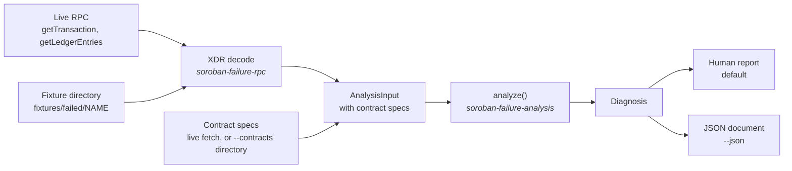

# Architecture

This document describes what is implemented today. Planned work is listed
separately in [ROADMAP.md](../../ROADMAP.md), and nothing here describes it as
if it existed.

## Components

| Component | Path | Responsibility | I/O |
|---|---|---|---|
| `soroban-failure-analysis` | `crates/soroban-failure-analysis` | The analysis engine: transaction model, contract error resolution, failure rules, verdicts. | **None.** Enforced by CI ([purity.md](purity.md)). |
| `soroban-failure-rpc` | `crates/soroban-failure-rpc` | Fetches transactions and contract specs from an RPC endpoint, decodes XDR, loads recorded fixtures. | Network in `client.rs`; filesystem in `fixture.rs`; the rest is pure. |
| `sdo` | `crates/sdo` | The command line interface: `sdo explain`, text and JSON output. Also holds the integration tests. | Presentation only. |
| `sdo-probe` | `tools/rpc-probe` | Research instrument from M0: measures endpoints, scans ledgers for failures, captures fixtures. Not published (`publish = false`). | Network, by design. |

Supporting code:

- `soroban-failure-rpc/examples/` holds the one-off measurement tools
  (`survey_failures`, `capture_contract`, `pilot_report`,
  `verify_protocol_assumptions`). They are run by hand and never by CI.
- `soroban-failure-rpc/src/xdr.rs` decodes RPC-supplied XDR under explicit
  depth and length limits, so a hostile response cannot drive unbounded recursion
  or allocation. Its depth bound is an engineering choice, not a protocol maximum.
- `soroban-failure-rpc/src/cluster.rs` and `evaluation/` belong to the M5 pilot.
  They are measurement infrastructure, not part of diagnosis.

## How the pieces fit

```mermaid
flowchart LR
    tx["Stellar / Soroban transaction<br/>(getTransaction response)"]
    rpc["RPC access and XDR decoding<br/><i>soroban-failure-rpc</i>"]
    model["Transaction model<br/><i>analysis: model/</i>"]
    evidence["Diagnostic evidence<br/>events, call tree, footprint, auth entries"]
    rules["Failure classification<br/>eight rules in a registry"]
    conf["Confidence and evidence<br/>Confirmed, Likely or Possible, with citations"]
    explain["Developer explanation<br/><i>sdo explain</i>, text or --json"]

    tx --> rpc --> model --> evidence --> rules --> conf --> explain
```

The engine never sees a network endpoint. Everything it needs arrives as an
`AnalysisInput`, which `soroban-failure-rpc` builds from either a live response
or a committed fixture. That is why the same analysis runs offline in tests and
against mainnet.

## The diagnostic pipeline

1. **Decode.** `soroban-failure-rpc::decode` turns the RPC JSON into typed XDR
   (`TransactionEnvelope`, `TransactionResult`, `TransactionMeta`, diagnostic
   events) using bounded decoding.
2. **Model.** `TransactionModel::from_input` unwraps fee bumps once, classifies
   the `FailureStage`, reconstructs the contract call tree from diagnostic
   events, and keeps **declared** resources (footprint, limits) apart from
   **observed** consumption. See [transaction-model.md](transaction-model.md).
3. **Resolve contract errors.** `contracts_needing_specs` says which contracts
   the transaction's errors need. The CLI fetches only those specs, and
   `resolve_contract_errors` turns `Error(Contract, #N)` into a name when the
   spec's WASM is in the transaction's footprint. See
   [contract-errors.md](contract-errors.md).
4. **Classify.** Each rule in `RuleRegistry::builtin()` evaluates the model and
   returns a `RuleOutcome`. Rules do not read each other's results.
5. **Diagnose.** `analyze` collects every outcome into a `Diagnosis`, which keeps
   the ranked candidate causes, contract errors, every rule's report, and the
   limitations. `Diagnosis::verdict()` gives one answer.
6. **Present.** `sdo` renders the diagnosis as text, or as JSON with `--json`
   ([json-output.md](../json-output.md)).

The `sdo` CLI fetches only the specs that `contracts_needing_specs` names for
this transaction. Without `--contracts` in fixture mode, no spec is fetched, and
contract error names are reported as unavailable.

## The evidence model

### Stage is observed; cause is claimed

- `FailureStage` is read mechanically from the transaction result. It is not a
  judgement.
- `CauseClass` is a rule's interpretation. It always arrives wrapped in a
  `CandidateCause`, which carries a `Confidence`, the `Evidence` it rests on, and
  a remediation.

Diagnostic events are unmetered and are not part of consensus. Keeping the two
apart in the types means an inference cannot be presented with the same
authority as a result code.

### Absence of evidence is not evidence

`AnalysisInput` carries `diagnostics_enabled` alongside the events. An empty list
means different things depending on it:

| `diagnostics_enabled` | Events | Meaning |
|---|---|---|
| `false` | empty | The node does not emit them. **Infer nothing.** |
| `true` | empty | The node emits them and this transaction produced none. A real observation. |

Rules call `has_diagnostic_evidence()` before reasoning from events.

### Confidence

| Level | Meaning |
|---|---|
| **Confirmed** | The host or protocol states the cause, and the transaction's own data independently corroborates it. Or the result code is itself defined as that cause. |
| **Likely** | The host states the cause, but no independent corroboration is available. |
| **Possible** | Consistent with the evidence, but the error did not end the invocation, or the evidence conflicts. |

Confidence is a property of each candidate, set by the rule that produced it.
The rule documentation states the conditions for each level. A rule may never
return a level above what its evidence supports.

### Verdict

`Diagnosis::verdict()` reduces the rule outcomes to one answer:

| Verdict | When | Meaning |
|---|---|---|
| `NotAFailure` | The transaction succeeded. | Nothing to explain. |
| `Explained(confidence)` | At least one rule matched. | The top cause, at the stated confidence. |
| `InsufficientEvidence` | Some rule could apply, and none found enough evidence. | **Unknown.** `rule_reports` says what was missing. |
| `Unsupported` | No implemented rule concerns this kind of failure. | **Not covered.** A different answer from unknown. |

`InsufficientEvidence` says "we looked and could not tell". `Unsupported` says
"we have no rule for this". Conflating them would make the tool look more
complete than it is.

## How rules produce diagnoses

Every rule returns one of three outcomes:

- `Match(CandidateCause)`: the evidence supports a cause.
- `NoEvidence { reason }`: the rule could apply, but the evidence it needs is absent or inconclusive.
- `NotApplicable { reason }`: the rule does not concern this transaction.

[rules.md](rules.md#how-a-diagnosis-is-built) shows how those outcomes become a
verdict, as a flowchart.

Candidates are ranked by confidence. Ties keep registration order, so output is
the same from run to run.

The eight rules are documented in [rules.md](rules.md). Each has a fixture or is
marked as having none.

## Why `contract_trap` is capped at Likely

A `contract_trap` candidate says the contract trapped on a WebAssembly
`unreachable` instruction. That is what a Rust panic compiles to, but it is also
emitted by other code paths. The only evidence is the host diagnostic string
`VM call trapped: UnreachableCodeReached`. No field gives the source line.

Confirming the cause would mean naming a panic site that the evidence does not
show. So the rule states the trap and the emitting contract and function, and it
stops there, at `Likely`. Its remediation lists the candidate panic sites for the
developer to check. The engine never reaches `Confirmed` for this rule.

## Contract-defined errors

A contract that raises an error puts only a number on chain, such as
`Error(Contract, #2)`. The name exists only in the contract's spec, which the
Soroban SDK embeds in the WASM.

The engine resolves that number in several steps, and each step can fail with a
named reason:

1. **Identify** the contract that emitted the error. If more than one contract
   emitted it, the engine reports ambiguity rather than choosing.
2. **Check provenance.** The spec is used only if its WASM hash is in the
   transaction's footprint. Contracts can be upgraded after a failure, so a spec
   fetched today may describe different code.
3. **Look up** the code in the spec's error enum.

The result is one of seven `ErrorResolution` outcomes: `Resolved`,
`CodeNotInSpec`, `AmbiguousInSpec`, `SpecUnavailable`, `SpecVersionMismatch`,
`ContractNotIdentified`, `NotApplicable`. A name is reported only for
`Resolved`. Details are in [contract-errors.md](contract-errors.md).

Stellar Asset Contract errors are not named, because the SAC has no on-chain
spec.

## Testing and CI

| Layer | Where | Network? |
|---|---|---|
| Unit | Beside each module | Never |
| Fixture and integration | `crates/sdo/tests/` and `crates/soroban-failure-rpc/tests/` | Never |
| Live measurement | `tools/rpc-probe`, and the examples, run by hand | Yes, by design |

Integration tests also guard the corpus: required files exist, hashes in
`probe.json` match `rpc-response.json`, analysis is reproducible, and no fixture
contains a secret.

CI ([ci.yml](../../.github/workflows/ci.yml)) runs these jobs on every push to
`main` and every pull request:

| Job | What it checks |
|---|---|
| `fmt` | `cargo fmt --all --check` |
| `clippy` | `cargo clippy --workspace --all-targets --all-features -- -D warnings` |
| `test` | `cargo test --workspace --all-features`, on stable and on the MSRV (1.88) |
| `docs` | `cargo doc` with `-D warnings`, so broken intra-doc links fail |
| `analysis-purity` | The analysis crate's dependency tree matches an allowlist ([purity.md](purity.md)) |
| `deny` | `cargo-deny`: licences, bans, and registry sources |

CI never contacts an RPC endpoint.

## Current implementation and what is not built

**Implemented:**

- Transaction model, fee-bump unwrapping, failure-stage classification, call tree
- Contract-defined error naming, with provenance checks
- Eight failure rules, with the evidence and confidence levels above
- `sdo explain` in text and JSON, from a fixture or the live network
- Bounded decoding of RPC-supplied XDR
- The M5 population pilot, as measurement tooling

**Not implemented:**

- Rules for archived entries, resource limits, and insufficient resource fees.
  These exist as code, validated only by synthetic tests, with no real fixture
  yet. See [rules.md](rules.md#result-code-rules).
- Any failure category beyond the eight rules. Those return `Unsupported`.
- Accuracy measurement against labelled references. This is M5, and it is not
  complete, so no accuracy figure is claimed anywhere in the project.
- A WASM build, a GitHub Action, or a crates.io release. These are M6 and M7.
- A web interface. See M8, and [the validation notes](../research/00-validation.md)
  for why it is deferred.

## The four decisions that matter

1. **The core crate performs no I/O.** Every rule is a pure function over decoded
   structures, so the corpus is testable offline. This is enforced by CI. See
   [purity.md](purity.md).
2. **Rules are a registry, not a match statement.** A `Rule` is a trait with
   `evaluate(&FailureContext) -> RuleOutcome`. A new failure mode is one file,
   one fixture and one test, not a change to a central `match` that every
   contributor must understand.
3. **Stage is observed; cause is claimed.** Two enums, kept apart on purpose.
4. **Absence of evidence is not evidence of absence.** Covered above.

## Further reading

- [The purity rule](purity.md)
- [The canonical transaction model](transaction-model.md)
- [Contract error resolution](contract-errors.md)
- [Failure classification rules](rules.md)
- [JSON output](../json-output.md)
- [Failure taxonomy](../research/failure-taxonomy.md)
- [M0 feasibility report](../research/m0-report.md)
- [Pre-build validation](../research/00-validation.md)
